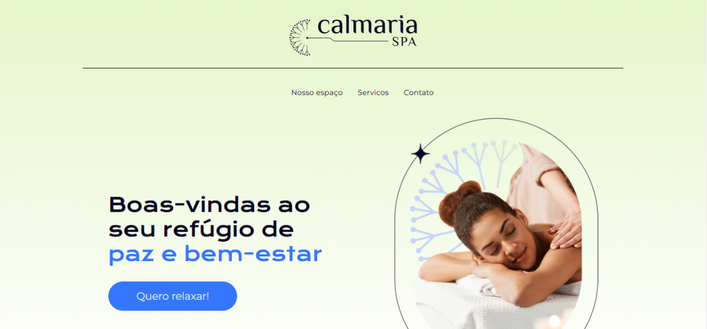

# 💆 Calmaria Spa



Landing page fictícia de um spa, desenvolvida com foco em design limpo, boa usabilidade e responsividade. Criada para praticar a construção de interfaces modernas e atrativas.

---

## 🚀 Funcionalidades

- 🧘 Seção inicial com logo em destaque e chamada principal
- 🏡 Apresentação do espaço com ênfase em conforto e tranquilidade
- 💅 Lista de serviços com descrições envolventes
- 📨 Formulário para inscrição com descontos e área de contato
- 📱 Design totalmente responsivo (mobile-first)

---

## 🛠️ Tecnologias utilizadas

- HTML5
- SCSS
- JavaScript
- [Vite](https://vitejs.dev/)
- [Sass](https://sass-lang.com/) 
- Hospedagem: [Vercel](https://vercel.com/) 

---

## 💻 Como rodar o projeto localmente

```bash
# Clone o repositório
git clone https://github.com/A1AD10/calmaria_spa.git

# Acesse a pasta do projeto
cd calmaria_spa

# Se usar Vite ou outra stack, rode os comandos abaixo
npm install
npm run dev

```
## 🌐 Link para acesso online

➡️ [calmaria-spa.vercel.app](https://calmaria-spa.vercel.app)

---

## 📌 Observações

Este projeto foi desenvolvido como exercício de prática em construção de landing pages com foco em:

- Estrutura visual clara e profissional  
- Responsividade e mobile-first  
- Experiência do usuário (UX)  
- Interface elegante e acessível  

---

## 📈 Possíveis melhorias futuras

- Animações de transição com CSS  
- Dark mode  
- Integração com serviços de e-mail  
- Formulário com validação e backend simples  

---

## 👨‍💻 Desenvolvedor

**Aladio Vanderlei de Lima Junior**  
🔗 [LinkedIn](https://www.linkedin.com/in/aladio-junior285)  
🌐 [Portfólio](https://meu-portfolio-opal-pi.vercel.app)
